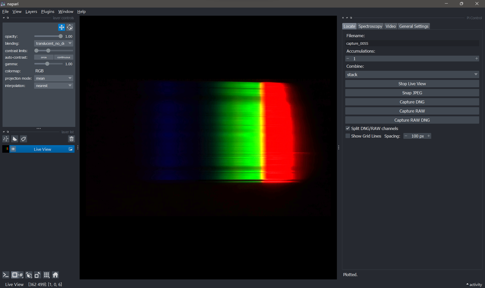
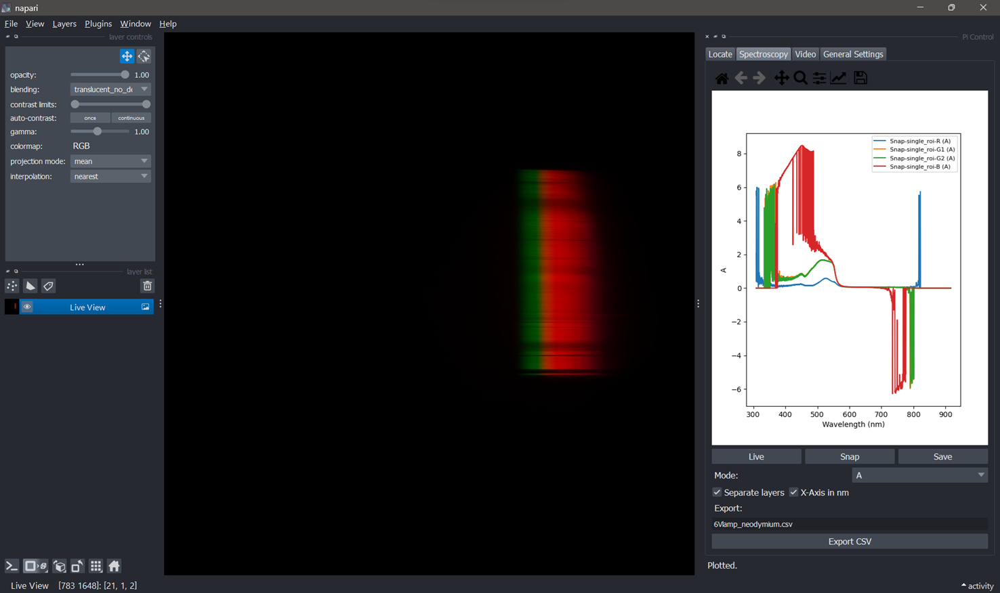
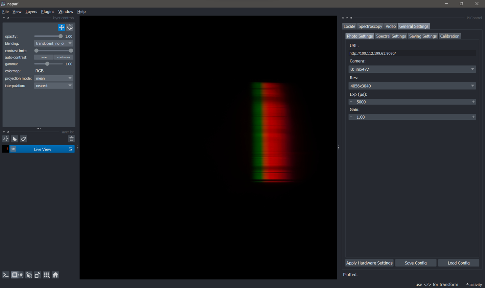
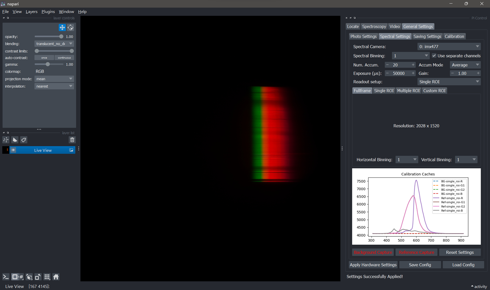
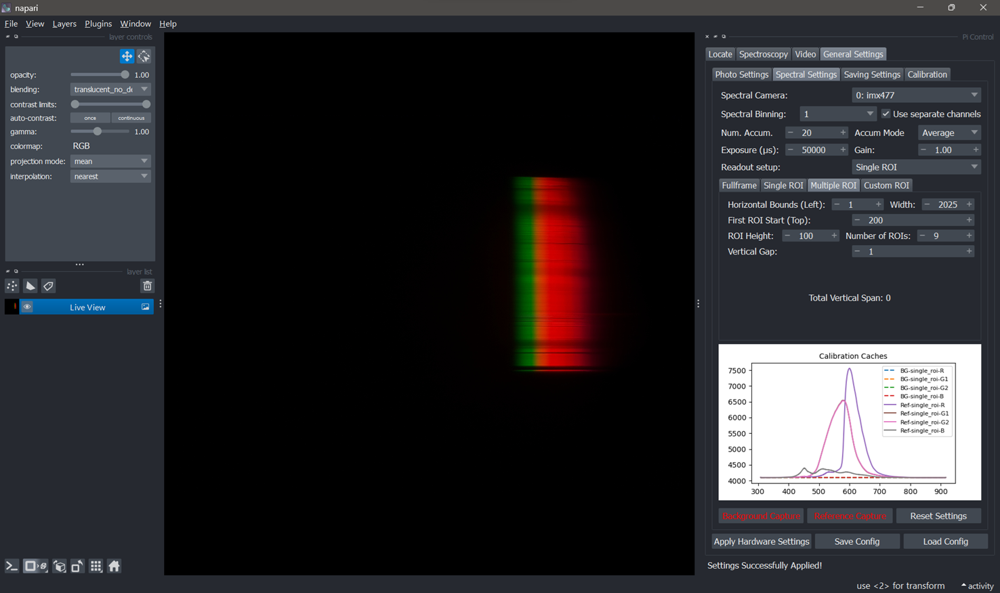
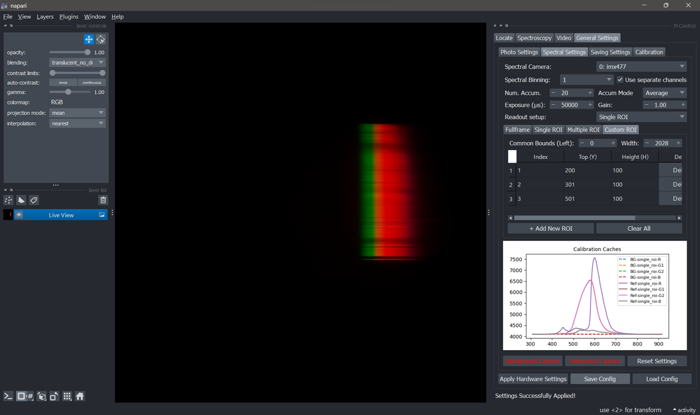
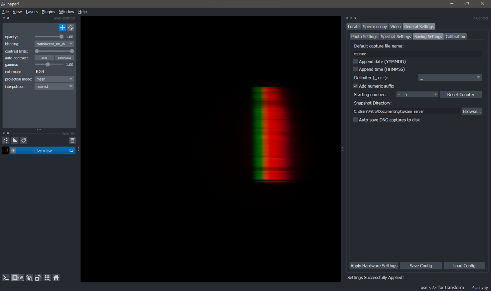
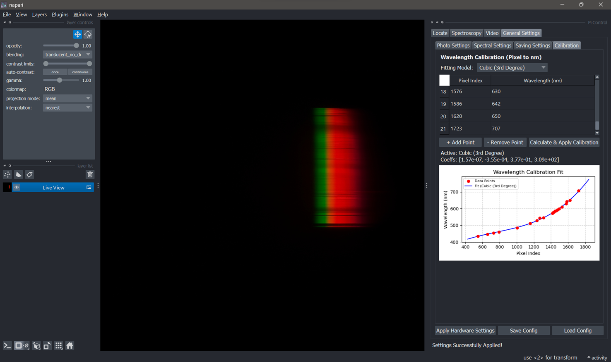

# PiCam Server Spectral

PiCam Server Spectral provides a Flask-based HTTP control server for Raspberry Pi camera modules and a Napari dock widget for desktop control, raw capture, spectral acquisition, calibration, preview, and recording workflows.

The current codebase is split into:

- `picam_server_spectral_V8.py` — Raspberry Pi Flask/Picamera2 server.
- `PiCamPlugin.py` — current desktop launcher; run this with `python PiCamPlugin.py`.
- `widgets.py`, `core.py`, `tabs_control.py`, `tabs_settings.py` — modular Napari client.
- `cam_config.json` — saved camera, spectral, saving, and calibration settings.

Older names such as `python_server.py`, `python_server2.py`, `napari_plugin.py`, and `napari_plugin_clean_api.py` are legacy names and should not be used for this current file set unless those legacy files also exist in the repository.

## Features

- Detects connected Picamera2 cameras, reports parsed sensor modes, and supports camera switching by index.
- Streams MJPEG preview from `/video` and one-shot JPEG preview frames from `/snapshot.jpg`.
- Captures raw Bayer data through `/rawframe`, including accumulation support and `stack`, `mean`, or `sum` combine modes.
- Captures DNG files through `/capture_dng` and can display DNG previews in Napari when `rawpy` is installed.
- Records hardware-encoded H.264 video through `/start_recording` and `/stop_recording`.
- Provides spectroscopy workflows for full-frame, single ROI, multiple ROI, and custom ROI acquisition.
- Supports background/reference spectra, Intensity, Intensity-BG, Transmittance (`T`), and Absorbance (`A`) plotting/export.
- Supports wavelength calibration using linear, quadratic, cubic, prism/Hartmann, grating, and Cauchy-style models.
- Saves camera, spectroscopy, saving, and calibration settings in `cam_config.json`.
- Includes a Locate tab with live view, JPEG snapshots, DNG capture, RAW capture, split-channel display, and an adjustable grid overlay.

## Repository Layout

| File | Purpose |
| --- | --- |
| `picam_server_spectral_V8.py` | Main Flask/Picamera2 server. Exposes camera control, raw capture, spectral capture, recording, and dashboard endpoints. |
| `PiCamPlugin.py` | Current launcher script for the desktop Napari control panel. Creates the Napari viewer and docks `PiCamPlugin` as `Pi Control`. |
| `widgets.py` | Main Napari dock widget/controller. Assembles tabs, stores shared state, saves/loads `cam_config.json`, and applies settings. |
| `core.py` | Headless client-side logic: settings stores, HTTP request handler, raw decoding, Bayer/CFA channel splitting, spectral math, and calibration functions. |
| `tabs_control.py` | Napari control tabs: Locate, Spectroscopy, and Video. |
| `tabs_settings.py` | Napari settings tabs: Photo Settings, Spectral Settings, Saving Settings, and Calibration. |
| `cam_config.json` | Example/current persisted configuration for camera, spectral acquisition, saving, and wavelength calibration. |
| `docs/images/` | README screenshots of the current Napari UI. |
| `snapshots/` | Server-side temporary still-capture artifacts when using snapshot download endpoints. Created at runtime if needed. |
| `recordings/` | Server-side H.264 recording output directory. Created at runtime if needed. |

## Requirements

### Raspberry Pi server

- Raspberry Pi 4 or 5 running a recent 64-bit Raspberry Pi OS with libcamera and Picamera2 support.
- Python 3.10 or newer.
- Picamera2 and libcamera should normally be installed from Raspberry Pi OS packages, not from PyPI.

```bash
sudo apt update
sudo apt install python3-picamera2 python3-libcamera python3-numpy libcamera-apps python3-opencv
```

Python packages used by the server:

```bash
pip install "Flask<2.3" numpy opencv-python
```

`Flask<2.3` is recommended for the current server code because it still uses Flask's legacy `before_first_request` startup hook. Remove this pin after moving startup initialization to a newer Flask-compatible pattern.

### Napari workstation/client

Install the desktop-side packages in a separate environment on the workstation that will run Napari:

```bash
pip install "napari[pyqt5]" qtpy numpy scipy requests matplotlib opencv-python rawpy
```

Notes:

- `rawpy` is optional, but needed for DNG preview/loading in the Napari client.
- `scipy` is needed for non-polynomial calibration fitting models.
- `matplotlib` is used for embedded plots in the Spectroscopy, Spectral Settings, and Calibration tabs.

## Running the HTTP Server

1. Attach and validate the camera hardware on the Raspberry Pi.
2. Start the current server from the project directory:

```bash
python picam_server_spectral_V8.py
```

3. The Flask app listens on `0.0.0.0:8080`.
4. Open the dashboard from another machine on the LAN:

```text
http://<pi-ip>:8080/
```

5. Use `/shutdown` from the dashboard or send a POST request to `/shutdown` for a clean stop.

## Running the Napari Control Panel

Run the current Napari client launcher from a workstation that can reach the Pi:

```bash
python PiCamPlugin.py
```

`PiCamPlugin.py` creates a Napari viewer, instantiates `PiCamPlugin` from `widgets.py`, docks it as `Pi Control`, and starts the Napari event loop. The project is not yet packaged as an installable Napari plugin, so for now this launcher script is the expected way to start the desktop UI.

Typical workflow:

1. Start `picam_server_spectral_V8.py` on the Raspberry Pi.
2. Start `PiCamPlugin.py` on the workstation.
3. In **General Settings > Photo Settings**, set the server URL, for example `http://192.168.0.197:8080`.
4. Pick the camera and resolution, then use **Apply Hardware Settings**.
5. Use **Locate** for live view, JPEG snapshots, DNG capture, raw capture, split-channel display, and grid overlay.
6. Use **General Settings > Spectral Settings** to choose spectral camera, binning, exposure/gain, accumulation count/mode, and readout setup.
7. Use **Spectroscopy** for Snap/BG/Ref acquisition, plotting, math mode selection, wavelength-axis display, and CSV export.
8. Use **Save Config** and **Load Config** to persist/restore `cam_config.json`.

## UI Screenshots

The screenshots below show the current `Pi Control` Napari dock. They are stored under `docs/images/` so the README renders correctly on GitHub or in Markdown-aware editors.

### Locate tab

Live preview, filename preview, accumulation/combine controls, JPEG/DNG/RAW capture buttons, split-channel toggle, and grid overlay.



### Spectroscopy tab

Snap/live/save controls, spectral math mode selection, wavelength-axis toggle, CSV export, and the embedded spectrum plot.



### Photo Settings

Server URL, camera selection, resolution, exposure, and gain.



### Spectral Settings

Full-frame readout:



Single ROI readout:


Multiple ROI readout:



Custom ROI readout:



### Saving Settings

Filename root, date/time options, delimiter, numeric suffix counter, save directory, and DNG auto-save preference.



### Calibration

Calibration point table, model selection, coefficient display, and wavelength fit plot.



## Configuration File

`cam_config.json` stores four top-level sections:

| Section | Contents |
| --- | --- |
| `camera` | Server URL, exposure, gain, and selected resolution. |
| `spectral` | Plot mode, split-channel setting, export filename, and the nested `ui_settings` payload sent to the server. |
| `saving` | Filename root, directory, date/time options, delimiter, numeric suffix state, and DNG auto-save preference. |
| `calibration` | Wavelength calibration coefficients, model type, and pixel/nm calibration points. |

The current sample config uses a cubic (`poly3`) wavelength calibration and stores spectral ROI/readout settings under `spectral.ui_settings`.

## Core API Endpoints

| Endpoint | Method | Purpose |
| --- | --- | --- |
| `/` | GET | Built-in dashboard with camera list and shortcuts. |
| `/available_cameras` | GET | JSON list of detected cameras and parsed Picamera2 sensor modes. |
| `/switch_camera/<index>` | GET | Switch active camera to the requested numeric index. |
| `/camera-info` | GET | HTML page showing current camera information, controls, and modes. |
| `/video` | GET | MJPEG preview stream. Supports `?exposure=<microseconds>`. |
| `/snapshot.jpg` | GET | One-shot JPEG frame. Supports `?camera_index=<index>` for explicit camera selection. |
| `/capture_snapshot` | GET/POST | Captures a raw TIFF snapshot; default `format=zip` bundles raw TIFF plus preview JPEG when available. `format=raw` returns only the raw TIFF. |
| `/capture_dng` | GET | Captures a DNG file. Supports `?camera_index=<index>`. |
| `/rawframe` | GET | Captures raw Bayer frame data. Query parameters include `camera_index`, `exposure`, `gain`, `duration`, `accumulations`, `combine`, and `mode`. |
| `/apply_recording_settings` | POST | Applies preview/recording resolution, exposure, and gain settings. |
| `/settings/spectral_acquisition` | GET | Returns persisted spectral acquisition settings. |
| `/settings/spectral_acquisition` | POST | Saves/applies spectral acquisition settings. |
| `/spectral_capture` | POST | Captures raw data with spectral ROI settings and returns extracted spectra as JSON. |
| `/start_recording` | POST | Starts hardware H.264 recording. Accepts JSON/form/query settings including `base`, `resolution`, `exposure_mode`, `exposure_time`, `gain_mode`, and `gain_value`. |
| `/stop_recording` | POST | Stops active recording and returns the file name. |
| `/download_recording?file=<name>` | GET | Downloads a recording from `recordings/`; the server deletes the file shortly after download starts. |
| `/record` | GET | Recording-oriented web page. |
| `/control` | GET | Quick manual control endpoint. Supports `?exposure=<microseconds>&gain=<float>`. |
| `/shutdown` | POST | Stops the server and releases the camera. |

## `/rawframe` Details

Example:

```text
/rawframe?camera_index=0&exposure=50000&gain=1.0&mode=4056:3040:12:U&accumulations=20&combine=mean
```

Important query parameters:

| Parameter | Meaning |
| --- | --- |
| `camera_index` | Optional camera index. If it differs from the active camera, the server switches before capture. |
| `exposure` | Exposure time in microseconds. Default is `2000000`. |
| `gain` | Analogue gain. Default is `5.0`. |
| `duration` | Optional capture wait time in milliseconds. If omitted, the server uses exposure-derived timing. |
| `mode` | Raw mode string in `WIDTH:HEIGHT:BIT_DEPTH:P_or_U` format, for example `4056:3040:12:U`. |
| `accumulations` | Number of frames to capture. Values are clamped to `1..64`. |
| `combine` | `stack`, `mean`/`avg`/`average`, or `sum`/`total`. |

Response headers describe how to decode the returned binary payload:

| Header | Meaning |
| --- | --- |
| `X-Raw-Shape` | Shape of the returned NumPy-style array. |
| `X-Raw-DType` | Element dtype, for example `uint16` or `uint64`. |
| `X-Raw-Mode` | Requested raw mode string. |
| `X-Raw-CFA` | Final inferred CFA/Bayer pattern after camera configuration. |
| `X-Raw-Accumulations` | Effective accumulation count. |
| `X-Raw-Combine` | Effective combine mode. |

`core.py` contains `DataHandler.decode_rawframe()`, which reads these headers case-insensitively and reshapes the raw payload for the Napari client.

## Spectral Acquisition

The spectral workflow has two paths:

- **Full frame**: the client calls `/rawframe`, decodes the raw payload locally, splits the Bayer mosaic into CFA channels, and displays the result as Napari image layers.
- **Single ROI / Multiple ROI / Multiple ROI Custom**: the client sends the ROI configuration to `/spectral_capture`; the server captures raw data, extracts 1D spectra from the requested regions, and returns compact JSON.

Supported readout setup values:

- `Full frame`
- `Single ROI`
- `Multiple ROI`
- `Multiple ROI Custom`

The server normalizes ROI bounds to the frame size and returns spectra grouped by ROI label and CFA channel. The client can either keep channels separate or average them into combined spectra.

### Spectroscopy math modes

| Mode | Requirement | Meaning |
| --- | --- | --- |
| `Intensity` | Snap profile only | Raw/intensity profile. |
| `Intensity-BG` | Background profile | Subtracts cached BG/dark profile. |
| `T` | Background and reference profiles | Transmittance-like profile using BG and Ref. |
| `A` | Background and reference profiles | Absorbance-like profile using BG and Ref. |

The Spectroscopy tab disables modes that do not yet have the needed BG/Ref caches.

## Wavelength Calibration

The Calibration tab maps pixel index to wavelength in nm. Supported model IDs saved in `cam_config.json` are:

- `poly1` — linear fit
- `poly2` — quadratic fit
- `poly3` — cubic fit
- `prism` — prism/Hartmann-style fit
- `grating` — physical grating-style fit
- `cauchy` — empirical Cauchy-style fit

After calculation, the client stores coefficients in memory, enables the **X-Axis in nm** option, redraws existing spectra, and saves the updated calibration to `cam_config.json`.

## Napari Tabs

### Locate


- Start/stop live view from `/snapshot.jpg`.
- Snap JPEG into a new Napari layer using the configured filename pattern.
- Capture DNG and display a processed RGB preview when `rawpy` is installed.
- Capture RAW or RAW DNG and display split CFA channels or a grayscale raw image.
- Toggle an adjustable grid overlay as a Napari Shapes layer.

### Spectroscopy


- Acquire Snap/BG/Ref profiles.
- Plot spectra with Matplotlib inside the Napari dock widget.
- Switch between pixel index and calibrated wavelength axis.
- Export plotted spectra to CSV with the currently selected math mode applied.

### Video

- Start/stop H.264 recording through the server.
- Uses the prefix entered in the Video tab as the `base` recording name.
- Current client implementation is intentionally minimal: it starts/stops recording but does not yet expose recording resolution, manual/auto exposure, gain mode, download/playback, elapsed time, or recording status in the Napari UI. Track these under the TODO list below.

### General Settings

Contains nested tabs for:

- Photo settings: server URL, camera, resolution, exposure, and gain.
- Spectral settings: camera, binning, accumulation, readout setup, ROI settings, and BG/Ref buttons.
- Saving settings: capture filename root, date/time suffixes, delimiter, numeric suffix counter, and save directory.
- Calibration: calibration point table, model selection, fitting, and calibration plot.

## TODO / Missing or Incomplete Work

### Packaging and installation

- Make the client installable as a real Napari plugin instead of starting it manually with `python PiCamPlugin.py`.
- Add plugin metadata, entry points, and packaging files, for example `pyproject.toml`, so the widget can be installed with `pip install -e .` and opened from Napari's plugin menu.
- Split server and client dependency extras, for example `.[server]` and `.[napari]`, so Raspberry Pi and workstation installs stay clean.
- Add a small launcher/CLI command after packaging, for example `picam-napari` for the desktop UI and `picam-server` for the Pi server.

### Video workflow

- Expand the Napari Video tab. The server already has `/start_recording`, `/stop_recording`, and `/download_recording`, but the current client only exposes a recording prefix and start/stop button.
- Add controls for recording resolution, manual/auto exposure, exposure time, gain mode, and gain value.
- Show current recording state, output filename, elapsed time, and errors in the Napari status area.
- Add a download button for the last recording, or a recording browser for files in the server-side `recordings/` directory.
- Decide whether video should use the Photo Settings camera/resolution or its own dedicated video settings section.

### Saving and acquisition workflow

- Implement or verify `auto_save_dng`. The setting is persisted in `cam_config.json`, but the current client-side DNG button primarily loads/displays the DNG; confirm disk-save behaviour before relying on it for unattended acquisition.
- Apply the configured save directory consistently to JPEG snapshots, DNG downloads, raw captures, spectra CSV exports, and recording downloads.
- Add overwrite protection and clearer filename previews for all capture types, not only Locate snapshots.
- Consider saving raw capture metadata next to downloaded arrays, for example as JSON sidecars containing shape, dtype, CFA, exposure, gain, accumulation count, and mode.

### Spectroscopy and calibration

- Add saturation detection and saturation warnings for raw and spectral captures.
- Add clearer validation for ROI bounds, empty custom ROI rows, and calibration point counts before capture/fitting.
- Add a way to export/import calibration independently from the full `cam_config.json`.
- Add tests or reference files for spectral math modes: Intensity, Intensity-BG, T, and A.

### Compatibility and robustness

- Update the Flask startup hook so the server works with current Flask versions without requiring `Flask<2.3`.
- Add connection checks in the Napari UI for unreachable server URLs and failed camera refreshes.
- Improve error handling around camera switching while live view, raw capture, or recording is active.
- Add a short troubleshooting section for common Picamera2/libcamera permission and camera-busy errors.

### Documentation

- Keep screenshots in `docs/images/` up to date when the Napari UI changes.
- Document example command lines for common API calls, including raw capture, spectral capture, DNG capture, and recording download.
- Keep legacy file names out of the main workflow unless those files are actually present in the repository.

## Known Caveats

- The server uses Flask's development server. For trusted LAN/lab use this is convenient, but for wider network exposure use a production WSGI setup and access controls.
- Some hardware behaviour depends on the exact Raspberry Pi model, camera sensor, libcamera/Picamera2 version, and sensor modes reported at runtime.
- Some raw modes can include stride/padding. Always trust `X-Raw-Shape`, `X-Raw-DType`, and `X-Raw-CFA` when reconstructing a payload.

## Technical Notes Preserved From Earlier README

### Bayer vs CFA Terminology
Picamera2 reports a `sensor_format` such as `SRGGB12` that encodes the pixel packing (bit depth, endianness, and whether the frame is still in its Bayer mosaic). The Color Filter Array (CFA) string, on the other hand, names just the RGGB/BGGR pattern that ends up inside the DNG metadata. When you request raw output, binning, HDR compositing, or ISP cropping can cause `sensor_format` and the exported CFA tag to diverge, so treat the format string as a transport description and the CFA as the definitive mosaic layout for demosaicing.

Example: a `/rawframe` capture might report `sensor_format=SRGGB12_CSI2P` but the configured stream exposes a final `CFA=BGGR`. The payload is still a 12-bit packed CSI-2 stream; only the mosaic order differs, so downstream processing should honour the CFA tag for demosaicing and treat the `sensor_format` as the transport description.

Field log excerpt:

```
Derived CFA pattern: RGGB from format=SRGGB12_CSI2P unpacked=SRGGB12 cfa entries=None None
Using raw format SRGGB12 for capture (packing U)
[22:35:18.032433013] [20486] INFO RPI pisp.cpp:1483 Sensor: ... - Selected sensor format: 4056x3040-SBGGR12_1X12 - Selected CFE format: 4056x3040-PC1B
[22:35:18.043842753] [20486] INFO RPI pisp.cpp:1483 Sensor: ... - Selected sensor format: 4056x3040-SBGGR12_1X12 - Selected CFE format: 4056x3040-BYR2
Updated CFA pattern after configure: BGGR (was RGGB)
Raw file captured. Size: 24709120 bytes. Sending as attachment.
```

Here the pre-configuration probe infers an RGGB CFA from the mode table, but once libcamera configures the full-resolution stream it reports BGGR and switches the CFE output from `PC1B` to `BYR2` to match the ISP routing. That flip reflects the ISP applying a transform (such as a sensor mirror or binning layout) before exposing the stream. Always trust the final CFA reported after configuration when selecting a demosaic kernel; the transport format remains `SRGGB12_CSI2P` either way.
Date: 2026-01-02

2. DETAILED CONTROL DESCRIPTIONS
================================================================================
- What it does: artificially enhances edges in the image.
- < 1.0: Softens the image (useful to hide noise in low light).
- Default: 1.0
- What it does: Adjusts the difference between the lightest and darkest parts.
- Higher: "Punchy" look, deeper blacks, brighter whites.
- Lower: "Flat" look, more gray. Better for post-processing/CV analysis.

SATURATION (0.0 - 32.0)
- Default: 1.0
- What it does: Controls color intensity.
- 0.0: Black and White (Grayscale).

AWB MODE (Auto White Balance)
- Range: 0-7
- Purpose: Compensates for the color tint of your light source.
- 0: Auto         (Camera analyzes scene and guesses)
- 1: Incandescent (For standard domestic bulbs - removes yellow tint)
- 2: Tungsten     (For studio hot lights - similar to Incandescent)
- 3: Fluorescent  (For office tube lights - removes green tint)
- 4: Indoor       (General calibration for mixed artificial light)
- 5: Daylight     (For sunny outdoor scenes - removes blue tint)
- 6: Cloudy       (For overcast outdoor scenes - warms up the image)
- 7: Custom       (Disables algos; uses manual ColourGains if provided)

METERING MODE (Auto Exposure)
- Range: 0-3
- Purpose: Decides which part of the image dictates the brightness.
- 0 (Center-Weighted): Prioritizes the middle 50% of the frame.
- 1 (Spot): Only measures a tiny dot in the center. Essential for backlit subjects.
- 2 (Matrix): Analyzes the whole frame to find a balanced average.

HDR MODE (High Dynamic Range)
- Range: 0-4
- Purpose: Helps when the scene has both very bright sun and dark shadows.
- How: The PiSP captures different exposures and merges them.

================================================================================
3. DIGITAL ZOOM (SCALERCROP) & HARDWARE EXECUTION

	| Mode | CCT Range (K) | Lighting Description |
	| --- | --- | --- |
	| Incandescent | 2500 – 3000 | Warm domestic bulbs |
	| Tungsten | 3000 – 3500 | Studio hot lights |
	| Fluorescent | 4000 – 4700 | Green-shift office tubes |
	| Daylight | 5500 – 6500 | Standard sun |
	| Cloudy | 7000 – 8000 | Overcast sky |
Coordinates:    ALWAYS relative to full 4056 x 3040 sensor.

IS DIGITAL ZOOM "HARDWARE" OR "SOFTWARE"?
-----------------------------------------
It is **Hardware-Accelerated Digital Zoom**.

1. It is "Digital":
	 - Unlike a physical lens zoom, this throws away pixels. 
	 - If you zoom 2x, you are using only the center 25% of the sensor. 
	 - You lose resolution, but the image does not get "blocky" if you stay 
		 within the sensor's limits (e.g., zooming into 1080p from a 12MP sensor 
		 looks perfect).

2. It is done in "Hardware" (The ISP):
	 - The cropping is NOT done by your Python script or the CPU.
	 - It is handled by the Raspberry Pi 5's dedicated Image Signal Processor (PiSP).
	 - **Benefit:** It causes ZERO delay or CPU load.
	 - **Benefit:** It can actually INCREASE framerate. If you crop to a small 
		 window, the sensor has fewer lines to read, potentially allowing faster FPS.

================================================================================
4. RESOLUTION MATH (DIVISIONS OF FULL SENSOR)
================================================================================
Scale 1/1:  4056 x 3040  (Native Full - 12MP)
Scale 1/2:  2028 x 1520  (Native Binning - 3MP - Best General Mode)
Scale 1/4:  1014 x 760   (Integer Scale)
Scale 1/8:   507 x 380   (Integer Scale - close to 480p)

## PiSP IMX477 Tuning Profile
The Raspberry Pi 5 ships distinct Image Signal Processor tuning files for each supported sensor. The PiSP profile located at `/usr/share/libcamera/ipa/rpi/pisp/imx477.json` defines the default behavior for the IMX477 (HQ) camera on RP1-based boards.

- Target Platform: `target` is set to `pisp`, meaning the profile is tailored for the Pi 5 hardware pipeline. Earlier SoCs use BCM2835-oriented tuning and do not expose PiSP-only features such as temporal denoise or hardware HDR blending.
- Auto Exposure: The `rpi.agc` block defines metering masks for matrix (uniform), center-weighted (gradient emphasis), and spot (tight central cluster) modes. Automatic shutter is capped at 66 ms (normal) or 120 ms (long exposure), while gain tops out at 8.0 or 12.0 respectively; manual overrides can exceed these limits when required.
- White Balance: `rpi.awb` enumerates fixed correlated color temperature bands, mapping Incandescent (2500–3000 K), Tungsten (3000–3500 K), Fluorescent (4000–4700 K), Daylight (5500–6500 K), and Cloudy (7000–8000 K) to the ISP’s AWB presets.
- HDR Pipeline: `rpi.hdr` enables dual-exposure fusion with `channel_map` assigning short and long reads. A dedicated Night mode tweaks tone mapping to lift deep shadows (e.g., input 20000 → output 47000) for low-light scenes.
- Lens Shading: The `rpi.alsc` luminance and chroma LUTs flatten vignetting and color shifts, with separate calibration tables for warm (3000 K) and daylight (5000 K) illumination to accommodate changing white points.
- Black Level: `rpi.black_level` fixes the sensor’s electrical floor at 4096, ensuring downstream processing treats anything lower as true black.
- Practical Tips: Night captures benefit from selecting the HDR Night profile or explicitly raising shutter/gain beyond the auto limits. Swapping lenses requires retuning the ALSC tables to avoid color rings or dark corners.

## Troubleshooting
- If `/available_cameras` returns empty, confirm Picamera2 is installed and the camera ribbon cable is seated. Run `libcamera-hello` to validate the hardware.
- For permission errors, add the executing user to the `video` group and reboot.
- High resolution captures and long exposures can take several seconds. Increase HTTP client timeouts when requesting `/capture_dng` or `/rawframe`.
- When running on Wi-Fi, prefer Ethernet for high throughput raw downloads.

## Custom Raw File Format Specification

**File Type:** Headerless Binary Dump  
**Extension:** `.raw`  
**Endianness:** Little-Endian  
**Metadata source:** Filename only (no internal header)

### 1. Filename Convention

All critical metadata required to parse the file is encoded in the filename string.

Format:  
`capture_cam{ID}_{Width}x{Height}_{Depth}bit_acc{N}_{Timestamp}.raw`

- **Width / Height:** The valid image resolution (e.g., 4056, 3040).
- **Depth:** The sensor readout bit-depth (`10bit` or `12bit`).
- **acc{N}:** The accumulation count. `acc1` is a single frame; `acc4` is a stack of 4 frames.

### 2. Binary Data Structure

The file consists of a contiguous stream of pixels with no file header.

- **Container Type:**
  - Standard / Mean Mode: `uint16` (Unsigned 16-bit integer).
  - Sum Mode: `uint64` (Unsigned 64-bit integer).
- **Bit Alignment (Critical):** Data is Left-Aligned (MSB aligned) inside the 16-bit container.
  - **12-bit Mode:** Values range from 0 to 65,520. (Shift right by 4 bits to get 0–4095).
  - **10-bit Mode:** Values range from 0 to 65,472. (Shift right by 6 bits to get 0–1023).

### 3. Hardware Padding (Stride)

The ISP (Image Signal Processor) adds invisible padding pixels to the end of every row for memory alignment. Parsers must read the "Padded Width" and crop to the "Valid Width".

| Valid Width | Stride (Padded Width) | Padding Pixels | Bytes per Row (16-bit) |
| ----------- | --------------------- | -------------- | ---------------------- |
| 4056        | 4064                  | +8             | 8,128 bytes            |
| 2028        | 2048                  | +20            | 4,096 bytes            |
| 1332        | 1344                  | +12            | 2,688 bytes            |

TODO: add saturation detection
